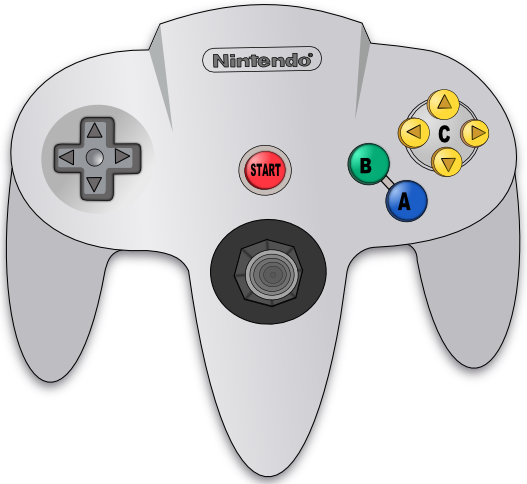

## Basic Controls
All menu interactions are performed using the controller and its associated buttons.
 

### File Browser
See [File Browser operations](31_file_browser.md) for additional information.

#### Fast scroll
Press either the `C-Up` or `C-Down` buttons to scroll by pages, rather than by elements.

#### Menu settings
Use `L` and `R` to switch tabs; Settings is the rightmost tab.
Choose Menu, Theme, Controller, Time, Information, Flashcart, or N64 on the left, then
press `A` to operate its pane. Press `B` to return to the category list.
The Time pane lets you set the date and time when your flashcart supports a Real-Time Clock (RTC).
In Theme, Up/Down chooses presets, Start copies a preset into Custom, and Z
previews the background. See [Theme controls](32_menu_settings.md#themes) for color,
panel opacity, and hue editing.

#### File options
Press `Z` in the file browser to open the options menu. Here you can view entry
properties, delete an entry, or set the current directory as the default folder.
Choose "Controller Pak manager" to open the Controller pane directly.

#### Additional ROM information
<!-- Could use a sample screenshot here -->
Press `A` on a ROM in the file browser to open its details. On that screen,
`Z` opens Extra Info and `Start` opens Advanced Info. Press `B` to close the
frontmost information window; press `B` again after closing the windows to return
to Files. `Z` and `Start` also toggle their respective windows.
Use Left and Right to cycle artwork, `R` for ROM options, and `A` to launch.

### 64DD-related

#### Expansion disks
To load an expansion disk (such as F-Zero X), first browse to the N64 ROM and load it (**but not start it!**), then browse to the 64DD expansion file and press either the `L` or `Z` button.

> [!TIP]
> Before pressing the `L` or `Z` button, press the `R` button and add the combination (ROM + Expansion disk) to your favorites.

#### Disk swapping
This feature is not currently available in N64FlashcartMenu.
