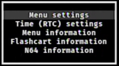

[Return to the index](./00_index.md)
## Basic Controls
<!-- Could use a sample screenshot of the controller and labels here -->

#### Fast scroll
Press either the `C-Up` or `C-Down` buttons to scroll by pages, rather than by elements.

#### N64FlashcartMenu settings
Press the `START` button on the browser screen to open the Settings window.  
  
From here you can edit some of the N64FlashcartMenu settings, see information about either the console, the flashcart you are using or N64FlashcartMenu itself, and if your cart has Real-Time Clock (RTC) support, you can also change its date and time.

#### Browser options
Press the `R` button to open the Browser Options window. Here you can see a ROM's properties, delete it from your SD card or establish the default folder 
where N64FlashcartMenu's browser will start in future boots.

#### Additional ROM information
<!-- Could use a sample screenshot here -->
Press either the `L` or `Z` button on the ROM information screen to open an additional window that will show additional information about the currently 
selected ROM file, such as its endianness, regional variant, set clock rate, and much more.

### 64DD-related

#### Expansion disks
To load an expansion disk (such as F-Zero X), first browse to the N64 ROM and load it (**but not start it!**), then browse to the 64DD expansion file and press either the `L` or `Z` button.

#### Disk swapping
This feature is not currently available in N64FlashcartMenu.
