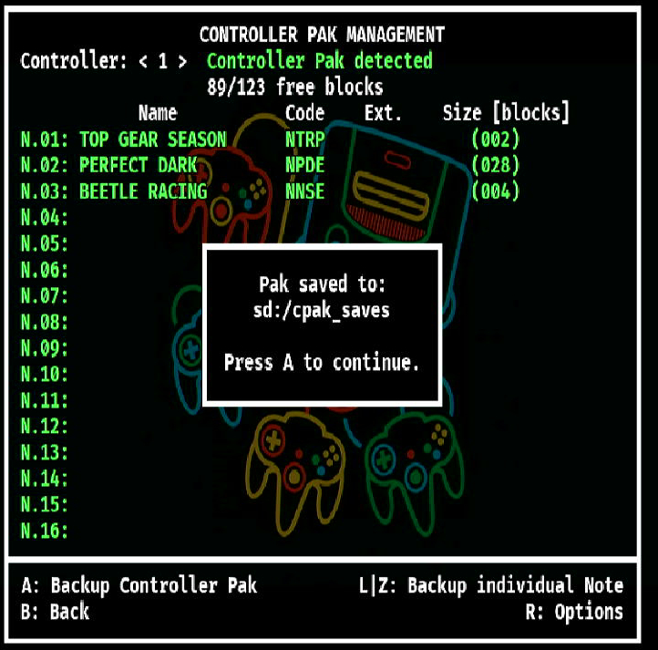

[Return to the index](./00_index.md)
## Controller Paks

> [!WARNING]
> **THIS FEATURE IS EXPERIMENTAL**

The N64FlashcartMenu has a Controller Pak Manager.

> [!CAUTION]
> Mileage may vary when hot swapping paks without exiting and re-entering the screen (and may contain incorrect content), and/or re-powering the console.

Features:
- Full pak backup and restore (saved to `SD:/cpak_saves/`).
- Partial pak ('note') backup and restore (saved to `SD:/cpak_saves/notes/`).

### Controller Pak Manager
Use the "Controller Pak Manager" (accessed using `Start` button ) to backup and manage the pak.
 

Browse to the saved file (usually contained within `SD:/cpak_saves/`) to restore it.
