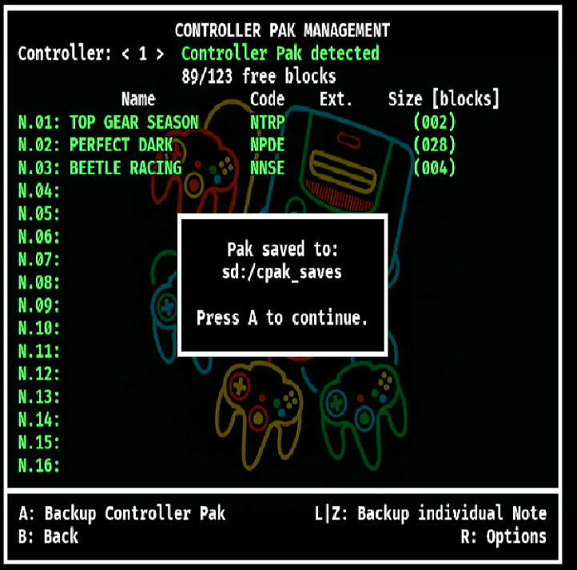

## Controller Paks
This feature still relies on a controller PAK being "plugged in" to a physical controller (port). The N64 hardware **CANNOT** emulate it from a flashcart.

> [!WARNING]
> **THIS FEATURE IS EXPERIMENTAL**

The N64FlashcartMenu has a Controller Pak Manager accessed from the `Start` button within the main file browser.

> [!CAUTION]
> Mileage may vary when hot swapping paks without exiting and re-entering the screen (and may contain incorrect content), and/or re-powering the console.

Features:
- Full pak backup and restore (saved to `SD:/cpak_saves/`).
- Partial pak ('note') backup and restore (saved to `SD:/cpak_saves/notes/`).

> [!NOTE]
> Note backup filenames may contain `%XX` sequences (e.g. `%2A` for `*`) when the original note name includes characters that are invalid in FAT filenames.
> This encoding is reversible — notes restore to the Controller Pak with their original name intact.

### Controller Pak Manager
Use the "Controller Pak Manager" (accessed using `Start` button ) to backup and manage the pak (including full backups or individual notes).
 

#### Restoring saves
To restore full backups or individual notes, browse to the saved file (usually contained within `SD:/cpak_saves/`) and follow the menu instructions.
