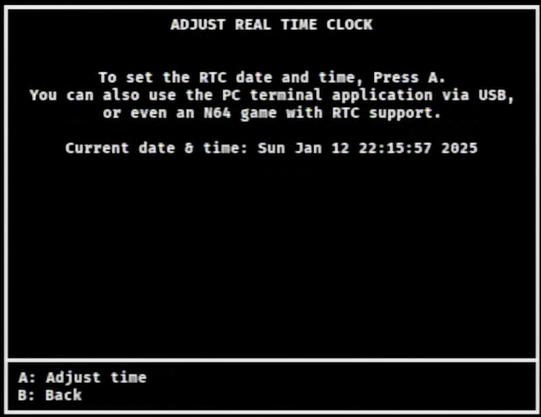

[Return to the index](./00_index.md)
## Date-Time (RTC) Settings

  
If your flashcart supports the Real-Time Clock (RTC from herein) feature, N64FlashcartMenu has the ability to read and set it.

Press the `START` Button on the File Browser and select `Time (RTC) settings` to enter the Adjust Real-Time Clock screen. Here you will see a notice regarding other ways to change the RTC. If your flashcart is compatible, press the `A` Button to display the RTC change prompt.

Press Up and/or Down on your Control Stick or Directional Buttons to modify the currently selected value, or Left and/or Right to select another value to change. If you are satisfied with the changes, press the `R` Button to save the current time and date and return to the Adjust Real-Time Clock screen. If you want to cancel your changes, press the `B` Button to return to the Adjust Real-Time Clock screen and keep the old RTC values.
