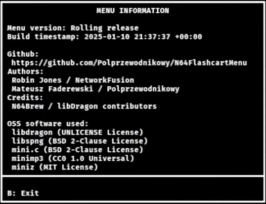

[Return to the index](./00_index.md)
## Menu information
  
This screen will show you various information regarding the N64FlashcartMenu you have booted, such as its version, its build date, and the developer credits.
