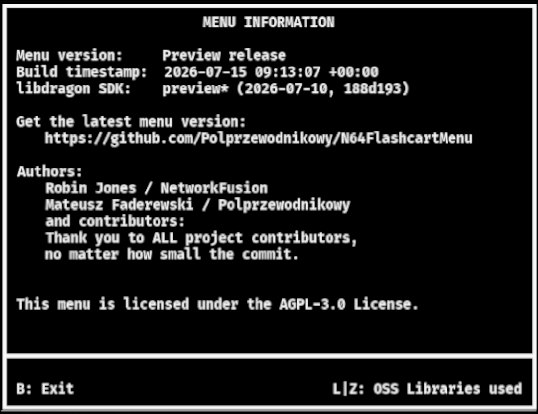

## Menu information
  
The Information pane in Settings shows the menu version, build date, libdragon
version, project URL, developer credits, and license. The third-party software
license summary appears inline below the credits.

Select Information and press `A`, then use Up and Down to scroll. Press `B` to
return to categories or `L` and `R` to switch tabs.
